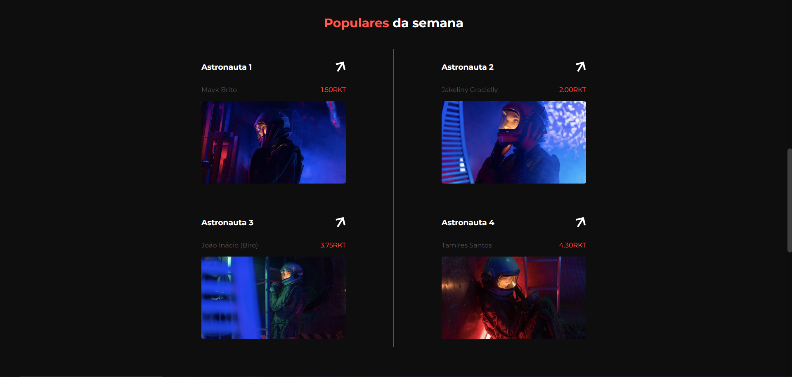

# Rocket NFTs

Aplicação inspirada no desafio do discover da Rocketseat

---

Descrição:

Sobre:

Landing Page sobre NFTs (Token não fungível) baseada no desafio discover da Rocketseat

Tecnologias utilizadas:

- React Js
- SCSS
- Typescript

Visão desktop :





Visão Mobile
\
\


\
\
Clonar repositorio

```
  git clone https://github.com/joaoh4547/rocket-nfts.git
```

\
\
Dentro de onde foi clonado o projeto:

Instalar as dependencias necessarias com

```
npm install
```

ou caso deseje usar o yarn

```
yarn
```

\
\
Execurar a aplicação com o comando

```
npm start
```

ou caso deseje usar o yarn

```
yarn start
```
